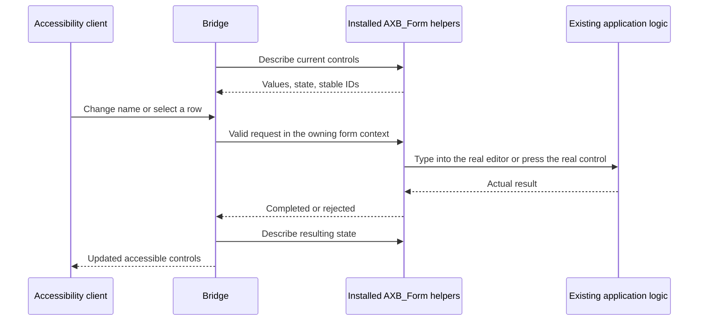

# Add accessibility to a 4D application

Install the bridge once per application. For ordinary controls, add a start call after form initialization and a stop call when the form closes. The bridge discovers the controls and uses their existing editors and actions. Add labels only where the visible UI does not supply a clear name.

This guide applies to any 4D project. Start with the [automatic ordinary-form example](examples/AUTOMATIC-FORM.md). The explicit [custom-provider example](examples/SIMPLE-FORM.md) and [legacy explicit AreaList example](examples/AREALIST-FORM.md) explain the existing extension contract.

The working source is an implementation checkpoint. Build both packages and install the host source from one commit. Mismatched parts fail at startup with a capability error; see the startup-result table below.

| Current status | Coverage |
| --- | --- |
| Previously exercised in isolated live fixtures; rerun in your host | Ordinary inputs/buttons, checkboxes/radios, typed dropdowns and hierarchical popup menus, editable combos, automatic page subforms with scrolling and reveal on macOS 26, semantic groups, described images, numeric/date/time progress, rulers and steppers, and all logical rows and columns of flat native array, collection, entity-selection and AreaList grids. AreaList text editing is limited to BMP text; further cell types remain open. Editable progress uses the shared-controller mapping below; other tested controls retain their existing editors and handlers. See [validation scope](VALIDATION.md) for the evidence boundaries and required reruns. |
| Previously exercised native cell controls; rerun in your host | Boolean checkbox/popup and numeric mixed-state cells, including repeated child grids and VoiceOver. See [validation scope](VALIDATION.md). |
| Still required | Tabs, dials, editable pictures, hierarchical lists, classic-selection grids and further grid layouts/cell types, AreaList supplementary Unicode and protected editing, IME and exact text geometry, further assistive-technology testing, standard-action dropdown menus, `AXScrollToVisible` before macOS 26, root forms larger than their window, expanded compiled desktop coverage, client/server delivery, and complete application workflows. |

The [full accessibility requirements](REQUIREMENTS.md) define completion. Resolve every unsupported control before calling its screen accessible.

## 1. Install once

There are three things to install. They have different jobs.

| Part | Put it here, relative to the host application | Job |
| --- | --- | --- |
| Native `AccessibilityBridge.bundle` | `Plugins/AccessibilityBridge.bundle` | Publishes the macOS accessibility tree and queues actions. |
| Compiled `AccessibilityBridge.4dbase` folder | `Components/AccessibilityBridge.4dbase` | Runs callbacks in the owning 4D form without using its timer. |
| Host source, installed by the command below | `Project/Sources/Methods` | Provides `AXB_Form` and helpers that read controls and use their real editors and actions. The installer merges compiler declarations. |

`Plugins`, `Components`, and `Project` are sibling folders. Prefer a matching release kit. To build from source, use macOS, Python 3.12+, Xcode Command Line Tools and the public checksum-pinned tool4d:

```sh
python3 build.py
python3 ci/download_tool4d.py
python3 build_component.py --tool4d build/toolchain/tool4d.app
```

The pinned download requires Apple Silicon. A licensed 4D Server can instead build with `--server "/path/to/4D Server.app"`; see [setup and version checks](SETUP.md).

Copy `build/AccessibilityBridge.bundle` and `build/AccessibilityBridge.4dbase` to the locations above, then restart the entire 4D host. `AXB_Form("start")` checks that the compiled component and plugin provide the capabilities required by the installed helpers. Missing capabilities return a specific error and leave normal form behavior available. The binaries are local build outputs, not source files to commit. For client/server deployment, verify that 4D's delivery installs both packages on a remote Mac client; that distribution test remains separate from local installation.

From the matching source checkout or complete release kit, install the host source with:

```sh
python3 install_host_methods.py --project-dir /path/to/MyApplication/Project
```

`--project-dir` names the directory containing `Sources`. Add `--area-list` when using AreaList Pro. Use `--compiler-method Compiler_Methods_YourTeam` to merge declarations into its existing compiler method. The installer touches source methods only and refuses to overwrite unmarked or edited generated methods, orphan generated helpers by dropping an install option, or create a second marked declaration block in another method.

Generated methods begin with `// Generated by AccessibilityBridge/install_host_methods.py; body SHA256:`. Do not edit these methods or the compiler block between `// Accessibility bridge host declarations begin` and its end marker. Change the canonical source under `host` and reinstall. Without `--compiler-method`, declarations go into `Compiler_AXBHost`. Local edits inside the marked declaration block are replaced on refresh. Use the same compiler target on every refresh; the installer rejects a different target while another method contains bridge declaration markers. To move declarations, move the complete marked block deliberately before reinstalling.

Your application owns its form methods, start/stop calls, configuration, formatters, controllers, error loggers and their compiler declarations. Give new application methods your own prefix. Existing application `AXB_*` methods without the generated marker remain application-owned.

Use `AXB_Form` in application code. Ordinary forms do not manage snapshots, revisions or receipts. Install host methods through the installer; copying `host/Methods` by hand would duplicate the component's private methods. `AXB_Host` remains available for specialized adapters.

The installer includes the native list-box helpers by default. Only the AreaList helpers require the extra `--area-list` flag.

Completion: the application compiles. If packages are optional in this host, verify that forms open normally with both removed. With both installed, `AXB_Form("start"; options)` on a test form returns `ok: true`. Report other errors through your application's diagnostics. Treat `dependencyUnavailable` as the normal optional-package absence result.

## 2. Connect one form

1. For an ordinary form, install the three bridge parts, add start/stop calls, supply missing labels, then check its coverage diagnostics.
2. For an invoice-like form, keep those calls and add a `grids` entry. Identify stable line keys, record `scope`, and loader `ready` state. Add descriptions for visual-only columns and map the existing selection controller only when selection must refresh other UI. The [assembled example](GRIDS.md#put-the-invoice-like-form-together) shows the result.

For a form with ordinary inputs, buttons, checkboxes, radio buttons, typed dropdowns, hierarchical popup menus and editable combos:

```4d
var $bridge : Object
// At the end of successful On Load initialization:
$bridge:=AXB_Form("start"; New object("label"; "Customer details"; \
 "onError"; Formula(ReportAccessibilityFailure($1))))
If (Not($bridge.ok=True) & ($bridge.error#"dependencyUnavailable"))
 ReportAccessibilityFailure($bridge)
End if

// On Unload and your existing fatal form-error cleanup path:
$bridge:=AXB_Form("stop"; New object)
```

`ReportAccessibilityFailure` stands for your existing application diagnostic method accepting a failure object. Substitute its actual name and reuse its compiler declaration; this is not a shipped helper or a requirement to add a bridge-specific logger. The callback handles later polling failures; check the returned object for startup failures. This pattern works with plain, entity, class-instance and shared roots.

Keep existing form and object methods. Enable the form's On Load and On Unload events if necessary. The bridge's scheduler leaves the existing form timer intact. Buttons run their ordinary action; text goes through the real editor, keystroke handlers and validation when editing ends. Protected inputs remain write-only. [The complete example](examples/AUTOMATIC-FORM.md) shows labels, coverage and verification.

An ordinary dialog can pass its existing data to `DIALOG` or use the implicit `Form` object. Use application-specific names such as `InvoiceAX_Start` for your configuration methods. Reserve the `AXB_` method prefix, `AXB_PollGuard` and `AXB_FormRoots` for installed bridge helpers. Session ownership is per window, so named roots may share business data. Automatic children may share data too.

### Preserve the form data and report failures

`AXB_Form("start"; options)` keeps root ownership in a window registry. A root bound directly to a persisted entity, class instance or 4D shared object needs no wrapper or extra attributes. Start and stop it through the same form hooks. The component must advertise `rootDataOwnership: 1`; otherwise startup returns `rootDataOwnershipUnavailable` before creating a session.

For those data types, report failures through your existing application diagnostics, outside the bound data. Reuse a method that accepts the failure object, shown here as `ReportAccessibilityFailure`:

```4d
$options:=New object("label"; "Customer details"; \
 "onError"; Formula(ReportAccessibilityFailure($1)))
$bridge:=AXB_Form("start"; $options)
If (Not($bridge.ok=True) & ($bridge.error#"dependencyUnavailable"))
 ReportAccessibilityFailure($bridge)
End if
```

`ReportAccessibilityFailure` is an application method, not an installed helper. The callback reports later polling failures after the bridge detaches its session and restores the existing error handler. Check the returned object for synchronous startup failures. Read coverage with `AXB_Form("diagnostics"; New object)` from the root.

Plain local data objects retain the compatibility properties `Form.axb*`, including `axbError` and `axbFailure`. Reserve them for the bridge and exclude them from persisted business data. Entity/class/shared roots have no such properties, so do not assign `Form.axbError` in their application error handling. Existing shared-object handlers retain their `Use...End use` locking; the bridge does not change the data's mutability or perform model writes.

Generated wrappers using `AXB_Dynamic` and explicit child registration still require private, plain local data. They return `unsupportedDynamicData` or `unsupportedRegistrationData` for entity/class/shared data before adding state. Generated preparation always returns the original form on failure, so open that returned form and report the error. Existing state on otherwise compatible data returns `dynamicDataInUse`. Automatic child discovery does not require explicit registration.

The component allocates and releases sessions. Forms can open and close as often as needed, with up to 64 bridge windows open at once in one 4D application instance.

Every automatic form requires the full automatic-control capability set, even if that form contains no grid or combo. Startup reports the first missing capability. Explicit `describe` providers have their own contract.

| Startup result | What to do |
| --- | --- |
| `dependencyUnavailable` | One or both optional packages are absent. Continue normal application behavior. |
| `incompatibleComponent`, `incompatibleNativePlugin`, `scrollableControlsUnavailable`, `adjustableControlsUnavailable`, `checkboxStatesUnavailable`, `formOwnershipUnavailable`, `rootDataOwnershipUnavailable`, `sessionLifecycleUnavailable`, `comboControlsUnavailable`, `nativeInputConfirmationUnavailable`, `controlSemanticsUnavailable`, `logicalGridsUnavailable`, `gridRowStatesUnavailable`, `gridControlsUnavailable`, `gridHeadersUnavailable`, `automaticControlsUnavailable` | Rebuild both packages and reinstall helpers from one source commit. |
| `too many active sessions` | 64 bridge windows are already open. Normal form behavior continues; close other bridge windows and reopen this form. |
| `window already has another session`, `plugin stopped` | Check for competing low-level registration, or restart the entire 4D host after plugin shutdown. Use one lifecycle owner per window. |
| `invalidLabel`, `invalidControls`, `invalidControlMetadata`, `invalidControlAdjustment`, `invalidChildren`, `invalidGrids`, or another invalid option | Correct the start options. The label is required. Each `controls` entry must be an object; `adjust` must be a Formula. |
| `noFormContext` | Call from the root form's existing On Load branch, with its actual `Form` object. |

The current native plugin advertises `sessions 2`; its component advertises `sessionAllocation: 1`. A `sessionLifecycleUnavailable` result means these packages do not match the installed helpers. Application code does not allocate or exchange native IDs.

For a screen that changes records without closing, set `options.scope` to Text or a Formula returning Text, such as `Formula(String(Form.invoiceID))`. Explicit providers instead return this string as `scope` from `describe`. Changing the scope invalidates retained controls for that record and its descendants. Stable row keys identify records within that scope. Neither a row index nor a product number is a record identity. Use `String()` for numeric record IDs.

Formula results are checked during polling. A `scope` or `controls.<object>.description` formula returning a non-Text value stops the bridge with `invalidScope` or `invalidControlDescription`, reported through `options.onError` and the plain-data compatibility properties. A successful start does not prevalidate later formula results.

For automatic discovery, omit both `describe` and `apply`. Supplying `apply` alone currently replaces the automatic action handler for every discovered control; it does not add an extra handler for one custom control. Use the explicit provider contract below when supplying your own action routing.

Three-state checkboxes need no extra configuration. Discovery reads their current mixed/checked/unchecked state; activation preserves the real control's cycle and existing handler. Install the matching native build, which advertises `checkboxes 1`.

Numeric, date and time steppers and rulers need no extra application hooks. They use the control's existing mouse or keyboard handling. Existing handlers and validation decide the result. Dates and times are spoken using 4D's default date/time format. Date rulers expose an incrementor because 4D's keyboard path can move beyond the configured minimum and maximum. Disabled and read-only controls remain readable.

### Child forms

With automatic discovery, start and stop only the root. Put child `label`, `scope`, `controls` and `grids` under `options.children.<containerObjectName>`, nested as deeply as the forms. `Form` in those formulas refers to that child instance.

In the parent form, immediately before `OBJECT SET SUBFORM` or rebinding the container's data, retire the old child:

```4d
$bridge:=AXB_Form("invalidate"; New object("subform"; "ShippingAddress"))
// Existing data binding and OBJECT SET SUBFORM follow.
```

If the bridge cannot identify the calling parent, it retires all child identities. Repeated children with shared bindings may also need the [focus observer](#repeated-controls-with-ambiguous-focus) in their reusable form method. See the [automatic child example](examples/AUTOMATIC-FORM.md#repeated-and-nested-page-subforms) for configuration, and the separate recipes for [generated forms](examples/DYNAMIC-FORM.md) and [explicit child providers](FORM-SUPPORT.md#explicit-child-providers).

### Scrolling and reading order

Automatic page subforms need no scrolling callbacks, including repeated and nested instances. Controls outside their current viewport remain in the accessibility tree with their full bounds. On macOS 26, `AXScrollToVisible` reveals a label or control through each containing subform. Scrolling a static label into view does not move keyboard focus away from the active editor. Editing, focusing or activating a control also reveals it first. Disabled values remain readable and revealable; editing and activation stay disabled. Hidden controls and inactive form pages remain excluded.

Siblings are read by their top edge, then their left edge, in the form's unscrolled layout. This is separate from 4D's entry order. A page subform's contents are read at the subform's position. If the spoken order is wrong, align the objects; a reading-order override remains unfinished. Scrolling changes screen coordinates without moving a control elsewhere in that order. Screen-position lookup uses the clipped visible portion, so an offscreen control cannot claim another control's screen location. An oversized button uses its visible portion for activation.

Install the matching native build, which advertises `scrolling 1`. Older packages return `scrollableControlsUnavailable`. Standard `AXScrollToVisible` is offered for ordinary controls and grid cells on macOS 26 only; support on earlier macOS versions is unfinished. Revealing a control before editing or activation has no OS-version restriction, but has only been tested on macOS 26.6.2 with 4D 20.8.

The bridge scrolls page subforms only. It never scrolls or resizes the root window. If no part of a root control lies inside the window, for example after the user shrinks it, the control stays discoverable, but revealing, focusing, editing and activating it are all rejected. Keep every root control inside the window at every supported size, or put long content in a page subform. Test resized windows as well as the initial form size. Actions also require the application's target window to be active; bring it forward before testing with an external accessibility tool.

### Repeated controls with ambiguous focus

Most forms need only start/stop. Repeated instances of one form can need one additional form-level observer when their controls share an object name and the same binding: a process or interprocess variable, or `Form.<property>` on a shared data object. The observer also handles an application handler moving focus between repeated editors. In 4D 20.8, a list-box data-change handler can move to an ordinary editor while the native caret API still reports the old grid's position. The bridge must identify the actual focused instance before it can publish focus or confirm an action.

Add this call at the top of each affected reusable form's method, before its event dispatch and any early return:

```4d
var $observed : Object
$observed:=AXB_Form("event"; New object)
// Existing Case of / form-event handling follows unchanged.
```

Enable that form's On Load event. The observer then enables its On Getting Focus and On Losing Focus events, preserving the other event settings. It observes every control in that form; object methods need no hooks. Each affected nested form needs its own call. The call also works when `Form` is Null, so place it before any application guard that returns for missing form data.

The observer does not start a bridge or change values. Existing form branches for the newly enabled focus events will also run, including when the root has not started accessibility. Retain their ordinary behavior. Focus events are enabled whenever both packages are present and the component is compatible, even if the root later fails to start because a native capability is missing. With absent or incompatible packages, the observer returns `dependencyUnavailable` or `incompatibleComponent` and leaves event settings alone. Handling that result is optional where accessibility packages are optional.

After the complete tree refreshes, the bridge resolves the event against current form instances. An observation that cannot identify one instance is discarded. Check the root's `AXB_Form("diagnostics"; New object)` report for `ambiguousFocus`; each issue gives the candidate control's child path. With shared data, the bridge distinguishes instances by position. If scrolling moves another instance into that position before the next refresh, it discards the observation and focus can remain ambiguous until it changes again. The diagnostic appears only while a repeated control has keyboard focus during a poll. Focus each candidate in turn, and exercise scrolling, record changes and child replacement.

### Map editable progress bars to a controller

Editable progress bars need one mapping to the application's shared value-change controller. 4D's local mouse handling can ignore a repeated adjustment after a programmatic reset. A controller also permits exact steps on a track whose pixel resolution is coarser than its values.

For example, suppose the `Temperature` progress bar is bound to `Form.temperature`. Its ordinary `On Clicked` handler already calls `SetTemperature(Form.temperature)`. Add this mapping to the existing start options, retaining any labels already configured:

```4d
If ($options.controls=Null)
 $options.controls:=New object
End if
If ($options.controls.Temperature=Null)
 $options.controls.Temperature:=New object
End if
$options.controls.Temperature.adjust:=Formula(SetTemperature(Form.temperature+$1.delta))
```

`SetTemperature` is your application method. Here is a complete example for a temperature from 0 to 100 with an associated text status:

```4d
#DECLARE($proposed : Real)
Form.temperature:=New collection(100; New collection(0; $proposed).max()).min()
Form.temperatureText:=String(Form.temperature)+" °C"
```

The control's ordinary `On Clicked` branch calls `SetTemperature(Form.temperature)`. In that path, 4D has already written the mouse-selected value. In the accessibility path, the formula proposes a value and the controller must store the accepted result. Move existing validation and dependent-UI updates into the shared method. If validation can refuse a mouse edit, retain the last accepted value in the form's existing edit state so the controller can restore it. The example above only clamps; it does not replace application validation.

The callback runs once in the owning form and receives `{objectName, operation, delta}`. `delta` is the configured step with a positive sign for increment and a negative sign for decrement. It is days for dates and seconds for times. Its return value is ignored. It must finish synchronously and apply the application's bounds, including when called at an endpoint. Leave the binding unchanged to refuse an accessibility adjustment. The bridge reads the binding afterwards: a changed value produces a completed receipt; unchanged at the requested endpoint means "at its limit"; unchanged elsewhere produces a rejected receipt. Date rulers have no endpoint in their native keyboard path. Date progress bars retain their actual endpoints.

Do not throw an error to report ordinary validation refusal. An unexpected callback error stops that window's bridge and calls `onError` when configured and records `Form.axbFailure` on plain local data only. The callback does not run the control's object method. Do not duplicate validation or invoke an object method outside its event context.

Steppers and rulers use their native handlers by default. Supplying `adjust` overrides that path and carries the same controller responsibilities. Use it only when a shared controller is needed. In subforms, put the mapping under `options.children.<container>.controls`; `Form` in the formula refers to that child instance. Invalid child metadata is detected when that child is discovered and reported through the root's `onError` callback and its `Form.axbError` compatibility property on plain local data.

Without the mapping, an editable progress bar remains readable as a slider but has no adjustment actions and reports `adjustmentCallbackRequired`. Resolve that diagnostic before declaring the form accessible. Read-only progress needs no callback. Numeric, date and time progress expose their actual range and horizontal or vertical orientation. Date progress uses days from its minimum as its numeric position and speaks 4D's default date format. Supply units through an optional `description` formula, such as `Formula(String(Form.quantity)+" items")`. A description replaces the spoken value, so include the date or time itself when describing one.

The matching native package, from this source commit, advertises `adjustables 2`. `adjustableControlsUnavailable` means the native package needs rebuilding or updating.

### Check the form's coverage

Read the last published coverage report in the debugger while paused in the root form method, or temporarily from an existing development-only button in that form:

```4d
var $coverage : Object
$coverage:=AXB_Form("diagnostics"; New object)
```

This is an optional debugging/verification call, not another lifecycle hook. Do not ship a new diagnostics call just to inspect the report. It returns `ready: false` until the first snapshot, then `ready: true`, the snapshot `revision`, `nodeCount` and an `issues` collection. Each issue names the form object's `object`, its nested subform `path`, and a `reason`. Grid issues can also identify a `column` object name. An empty path means the root. For example, `{path: ["ShippingAddress"], object: "Phone", reason: "missingLabel"}` identifies that input in that particular child.

`missingLabel` needs a meaningful label. `providerPending` means an unhandled object type is omitted from automatic discovery. This includes tabs, hierarchical lists, unconfigured grids, plugin areas and web areas. Accept an existing native provider only after verifying its complete tree and actions. Tabs and other controls without such a provider remain unfinished bridge work; do not dismiss their diagnostic. A verified usable web provider needs no extra adapter. Other reasons identify unsupported editing, ambiguous groups or an unavailable configured grid. `gridLoading` is temporary while the grid's readiness formula is false. A correctly configured grid is not reported as an unsupported ordinary control.

| Coverage reason | Required action |
| --- | --- |
| `missingLabel` | Supply a meaningful control label. |
| `ambiguousGroup` | Set the intended group explicitly in control metadata. |
| `ambiguousFocus` | Add the [form-level focus observer](#repeated-controls-with-ambiguous-focus) to the affected repeated forms and validate focus through their lifecycle. |
| `providerPending` | Verify a complete native provider, or implement the missing bridge family. |
| `popupValueTypePending` | The popup can open, but its selected value needs a supported reader. |
| `adjustmentCallbackRequired` | Map the editable progress bar to its existing shared controller using [`controls.<name>.adjust`](#map-editable-progress-bars-to-a-controller). |
| `pictureEditingPending` | Picture description is readable; editing remains unfinished bridge work. |
| `adjustableValueTypePending`, `progressValueTypePending` | This control variant needs further bridge implementation. |
| `gridLoading` | Wait for the configured loader; if it persists, check readiness and loaded-record identity. |
| `gridUnavailable` | Correct the grid configuration or implement its unsupported layout. A table asking for a displayed-value description needs `columns.<objectName>.value`, or `decorative` for content with no meaning or action. |
| `gridCellEditingPending` | In a native list box, an enterable column has a description or is marked decorative. Custom editor support is still required. Remove `decorative` from interactive content. The issue names the column. |
| `gridValueDescriptionRequired` | A requested native-grid cell has an unsupported value or its description did not return Text. Configure or correct the [column description](GRIDS.md#describe-custom-native-grid-columns). |

The report includes current root and nested-child issues, retires hidden/replaced children and contains no field values. Reading or modifying the returned copy cannot affect the form. It returns `unregisteredWindow` after stop, after a bridge failure, or when called inside a subform. Call from the root; inspect the failure passed to `onError`. Plain local data also exposes `Form.axbError` and `Form.axbFailure`.

Check every page, form state and supported window size. Offscreen page-subform content is included in the report. An empty issue list does not replace testing with accessibility tools. AreaList Boolean and described custom columns can be read-only through accessibility without producing an editing-pending issue. Compare every interactive vendor cell with its AX actions manually. Only automatic discovery contributes issues; the bridge cannot audit controls described by an explicit provider. [Validation scope](VALIDATION.md).

### Dropdowns keep their native menus

Text, numeric, date and time arrays, object-backed choices, choice lists saved as Text values or numeric references, and hierarchical popup menus need no additional application hooks. Discovery reads the displayed selection with the control's format. A choice stored as a numeric reference speaks its label; an object-backed placeholder speaks its `currentValue`. Other object properties remain private.

AXPress opens the actual 4D menu. Its existing menu items and submenus handle selection and call the application's ordinary click/data-change handlers. Disabled controls stay disabled. Replacing the backing object or changing its selection is discovered on the next poll. An unsupported binding leaves the popup operable with an empty value and adds `popupValueTypePending` to diagnostics. Resolve that issue before calling the screen accessible. Standard-action-generated menus still need dedicated validation.

### Editable combos use their existing data and handlers

Combos need the same start/stop calls as ordinary inputs. Keep their existing array, object or scalar binding. The bridge reads array element zero or the object's `currentValue`, uses the control's display format and exposes a combo box with editable text and native choices. It never publishes other fields from the bound object.

Typing, selecting text and replacing text use the real editor. Existing keystroke filters, automatic insertion and validation still run. Opening choices attaches 4D's actual popup beneath the combo in the accessibility tree. Selecting a row and confirming it uses the native list and normal Return key; cancelling uses Escape and preserves the prior value. Closed-dropdown confirmation and cancellation do not send keys to the containing form.

No application-written list of choices or separate selection callback is needed. If its label is unclear, set `controls.<object>.label` as for any input. The popup integration currently recognizes one native table directly above or below the focused combo. Unrelated or ambiguous windows are never adopted; unusual placement remains part of the multi-display validation work.

With VoiceOver, open the choices, use ordinary Down/Up arrows to move through spoken selections, and confirm with Return. This matches the tested AppKit combo. VO-Right moves to the arrow button rather than through the choices.

### Name groups, progress and image statuses

The working semantic-control extension reads group-box captions, numeric progress values/ranges and busy indicators automatically. It groups each control under its unique innermost containing group box, preserving the control's identity and existing handlers. Overlapping boxes that do not establish a clear hierarchy produce an `ambiguousGroup` diagnostic. Set `group` to the exact containing object's name to resolve that case, or to an empty string to keep the control at the root.

Images need meaningful text. The bridge uses an existing help tip or nearby label when available. Supply missing descriptions through the same optional `controls` metadata:

```4d
$options.controls:=New object(\
 "Packing"; New object("label"; "Packing progress"; \
  "description"; Formula(String(Form.packed)+" items packed")); \
 "ShipmentIcon"; New object("label"; "Shipment"; \
  "description"; Formula(Choose(Form.shipped; "Shipped"; "Waiting to ship"))); \
 "BackgroundLogo"; New object("decorative"; True))
```

A description is Text or a Formula returning Text in the owning form. Read the existing UI model; do not load records or change selection. VoiceOver needs the image's current text alternative in its accessible label. The bridge combines its label and description and preserves its stable identity. Decorative images are omitted. An undescribed image stays discoverable and reports `missingLabel`; resolve that diagnostic before calling the screen accessible.

Determinate progress exposes its actual range and supports numeric, date and time bindings. A spinner or barber-shop indicator reports activity without inventing a percentage. Read-only indicators have no adjustment actions; enterable progress bars use the adjustable-control path above. Editable pictures remain unfinished. See [validation](VALIDATION.md) for the current status and adjustable-control results.

### Configure data grids

Use [the grid recipe](GRIDS.md) for native array, collection or entity-selection list boxes and AreaList Pro. It covers stable keys, loading, selection controllers, cell descriptions, row metadata and an [assembled invoice-style example](GRIDS.md#put-the-invoice-like-form-together). Keep the root lifecycle above.

### Explicit providers for existing integrations

The earlier provider API remains available. Passing `describe` selects this explicit path; it does not merge your description with automatic controls. New flat array, collection, entity-selection and AreaList integrations should use [the grid recipe](GRIDS.md). With `describe`, you must include any ordinary controls yourself, using `AXB_Controls`, and route their actions through `apply`. The [earlier AreaList example](examples/AREALIST-FORM.md#leave-business-commands-in-the-application) illustrates this contract. The older summary providers remain available for existing integrations; their viewport-only descriptions do not satisfy full UI coverage.

An explicit provider supplies:

| You add | It does |
| --- | --- |
| A `describe` method | Returns allowed controls with their current values and state. `AXB_Controls` fills in live geometry, visibility, and enabled state for ordinary controls. |
| An `apply` method | Accepts an explicit action and calls the same validation/business logic used by a human interaction. Returns `completed` only when the application confirms completion, otherwise `rejected`. |
| Start/stop calls | Start after ordinary initialization; stop before unloading or abandoning the form after an error. |

The form must have an object returned by `Form`. For a dialog, pass the form data object to `DIALOG`. Keep business data in your own properties. Reserve `Form.axb*` and the process variables `AXB_PollGuard` and `AXB_FormRoots` for the bridge. Use the existing diagnostic reporter for startup results and `onError` for later failures. The `Form.axb*` compatibility properties exist on plain local data only; entity, class-instance and shared roots use the window registry.

```4d
var $bridge : Object
// At the end of successful On Load initialization:
$bridge:=AXB_Form("start"; New object(\
 "label"; "Customer details"; \
 "onError"; Formula(ReportAccessibilityFailure($1)); \
 "describe"; Formula(CustomerAX_Describe); \
 "apply"; Formula(CustomerAX_Apply($1))))
If (Not($bridge.ok=True) & ($bridge.error#"dependencyUnavailable"))
 ReportAccessibilityFailure($bridge)
End if

// On Unload and your existing fatal form-error cleanup path:
$bridge:=AXB_Form("stop"; New object)
```

`CustomerAX_Describe` and `CustomerAX_Apply` are application methods you write. They are examples of names, not shipped methods. [The simple form walkthrough](examples/SIMPLE-FORM.md) contains complete versions of both, plus the human event handlers and compiler declarations.

The component schedules these callbacks separately from the form timer.

Keep `describe` cheap and free of side effects. It reads current UI state; it must not query or save records on every poll, open dialogs, or change selection. `apply` may perform the allowed action and must return its actual result. Both callbacks must handle expected validation failures without raising a 4D error. If `apply` opens a transaction, its application error path must cancel that transaction on failure. The bridge aborts an unexpected failing callback; it does not roll back application transactions.

### The description and action contract

`AXB_Controls` creates nodes for ordinary objects. Grid adapters create the same node records. These bounds apply to the whole window, including its children:

| Field | Contract |
| --- | --- |
| Description | Object with `nodes`, a non-null collection. Optional `scope` is Text; optional `enabled` is Boolean. |
| `subforms` | Optional collection of immediate child container object names. |
| Local `id` | Unique within that form, nonempty Text, at most 78 UTF-16 units. The helper adds a 50-unit instance prefix. |
| `role` | `button`, `checkbox`, `radio`, `popup`, `textfield`, `text`, `table`, `row`, `cell`, `group`, `image`, `progress`, `slider`, or `stepper`. |
| `label` | Text, at most 512 UTF-16 units. Use a meaningful accessible name. |
| `value` | Text, at most 1,048,576 UTF-16 units. Checkboxes use Boolean or numeric `2` for mixed; radios use Boolean. Progress uses a finite number, or `null` when indeterminate. Convert other numeric/date values deliberately; protected text fields must have an empty value. |
| Progress state | `indeterminate` is Boolean. Determinate progress requires finite `min` and `max`, with `min <= max`. |
| Adjustable state | `adjustable` is Boolean and `step` is a positive finite number. Numeric sliders/steppers require finite `value`, `min` and `max`, with `min <= max`. Date steppers use a formatted Text value without numeric bounds. `valueDescription` can name units or provide a formatted date/time. Date progress sliders use numeric days from their actual minimum. Date rulers use the formatted incrementor representation. Optional `adjustment` selects `keyboard`, `pointer` for steppers, or `callback` for a host controller. Optional Boolean `vertical` describes slider/progress orientation. |
| `valueDescription` | Optional Text describing the current value in application terms. |
| `enabled`, `visible` | Boolean. Application permission and actual control state must both allow an action. |
| `frame` | Four finite numbers `[left, top, width, height]` in current-form coordinates, with positive width/height. |
| `clip` | Optional rectangle in the same coordinates; zero size hides the node. |
| `parent` | Optional local ID of a semantic group for ordinary controls and nested groups. Table summaries retain `table > row > cell`; rows need Boolean `selected` and integer `index` from 0 through 255. |
| Snapshot size | At most 4,096 ordinary nodes and 16 MiB serialized payload. Logical grid rows load separately and do not consume the ordinary-node budget. |
| Incoming action | `{id, node, operation, value}`; `node` and selection row IDs are your local IDs. `setValue` accepts Text on an editable text field; `press` acts on a button, checkbox, radio or popup; `selectRows` accepts at most 100 row IDs on a table. Adjustable controls accept `increment` and `decrement`. The automatic provider also handles `focus`, `setSelection` and `replaceSelection`. |
| Handler result | `{status: "completed" or "rejected", message: Text}`. Provide a useful message. The helper supplies a missing message and limits it to 512 UTF-16 units. |

Return `AXB_ListboxSelect`'s result unchanged. For every binding family it contains a private pending confirmation. `AXB_Form` polls that confirmation in the original form/subform instance and sends only a final `completed` or `rejected` receipt to the plugin. A hidden, replaced, background, or differently scoped form cannot run the deferred callback. Ordinary application handlers continue returning the two final statuses above.

This summary adapter waits for the actual selection, calls `onSelection` once, and checks again on a later poll. A changed selection, changed form scope or expired two-second deadline rejects completion without repeating the callback. Use automatic `options.grids` for new integrations to expose the complete grid.

A rejected receipt means completion was not confirmed; it is not a rollback guarantee. In particular, a list-box selection may have changed before its deferred confirmation was cancelled. Re-read the current binding and refresh dependent UI through the application's normal lifecycle handlers. See the [list-box recipe](examples/LISTBOX-FORM.md) for cancellation and reconciliation rules.

Invalid snapshots stop that window's bridge. They never authorize a partial or guessed action.

### When nothing appears in Accessibility Inspector

Check the `AXB_Form("start")` result first. Child options are also checked when that child is first discovered; an error can therefore occur after a successful start. If an AreaList configuration has no installed AreaList helpers, the first poll reports `areaListProviderUnavailable` and stops that window’s bridge, including its ordinary controls. For a later failure, inspect the object passed to `onError`. Plain local data also exposes `Form.axbError` and `Form.axbFailure`. The failure object includes the numeric code, method, and line for an unexpected callback error, without recording form values or source expressions.

To connect application diagnostics, add `"onError"; Formula(MyAX_Error($1))` to the root's start options. Create `MyAX_Error($failure)` to record the failure through your existing logger. It runs at most once after the failed registration is detached; a queued notification is discarded if the window closes first. For direct `AXB_Form` calls it does not report a failed `start`, which returns its error directly. The [generated-form wrapper](examples/DYNAMIC-FORM.md) also reports startup failures with `phase: "start"`; builder preparation failures use `phase: "prepare"` before opening and require a logger that does not depend on `Form`. Its own errors use the application's existing handler. The bridge temporarily installs a local handler only during polling, restores it before leaving or aborting the callback, and never changes the global handler. If a callback installs its own local handler, save `Method called on error(ek local)` and restore that exact value afterward, rather than clearing it. This follows [4D's scoped error handling](https://developer.4d.com/docs/20/Concepts/error-handling).

Correct the cause and explicitly call `start` again, or close/reopen the form. Failed actions are never replayed automatically. A successful registration clears the prior error.

## 3. Follow one action through the form



Setting a name through accessibility and typing that name must reach the same validation. The automatic provider enters text through the real editor; normal commit runs the form's existing validation. An explicit custom provider must preserve its application's equivalent behavior. An accessibility transport success code only means the request reached the bridge; verify the resulting application state.

An external AX client can read progress from the bridge root group's `AXHelp`. Locate that group by its `AXIdentifier` beginning with `axb.window.`. It reports `Action queued`, then `Waiting for the application to complete the action`, then the application's final receipt message. With no action history it reports `Ready`. The public attribute contains the message, not the internal `completed` or `rejected` status. Use it as a progress signal and read the target's resulting value, selection or focus to verify the outcome. For popup activation, completion means the menu opened; choosing an item is a separate native interaction. Neither transport success nor a timeout authorizes an automatic retry.

## 4. Choose the right extension

| Your form contains | Integration path |
| --- | --- |
| Ordinary inputs, buttons, checkboxes, radios, typed/object/choice-list dropdowns, hierarchical popup menus, editable combos, group boxes, progress, images and readable text | [Automatic form](examples/AUTOMATIC-FORM.md). Start/stop once; supply missing labels declaratively. |
| Flat array-backed AreaList grid | Use [`options.grids`](GRIDS.md). Bind existing row keys; describe image indicators and decorative spacers only where necessary. |
| Flat native array list box with complete rows and columns | Use [`options.grids`](GRIDS.md) alongside automatic ordinary controls. |
| Flat collection or entity-selection list box with direct property columns | Use `options.grids` with the existing Selected Items expression. Supply a collection key property, or use the entity dataclass's primary key. |
| Existing array, collection, or entity-selection summary integration | [Native list-box form](examples/LISTBOX-FORM.md). Configure the bound key column and permitted Text label columns; the helper resolves native selection after sorting and scrolling. |
| Ordinary page subforms, including repeated/nested instances | The current automatic provider discovers children from the root. Supply readable child labels and invalidate a container at its shared replacement point. See [the automatic child example](examples/AUTOMATIC-FORM.md#repeated-and-nested-page-subforms). |
| Subforms with explicit custom providers | Register each child with `AXB_Form("register"; options)`. The parent description lists its allowed subform object names. One root owns the scheduler. See [form families](FORM-SUPPORT.md#explicit-child-providers). |
| JSON-generated dialogs and subforms | [Generated-form recipe](examples/DYNAMIC-FORM.md). Wrap the opening point with `AXB_Dynamic`; preserve original form/object methods and standard actions. |
| Pages | Automatic discovery publishes current-page and inherited objects. Tab controls are not exposed yet, so page switching remains unfinished. See [form families](FORM-SUPPORT.md). |
| Other list-box bindings, editable grids, web areas, other controls | Use the family-specific behavior and limits in [form families](FORM-SUPPORT.md). A label alone does not make a control editable. |

## 5. Prove the application integration

First open the form with the bridge absent and confirm ordinary interaction still works. Then test with both packages installed, in interpreted and compiled hosts. Read values through an external AX client and verify valid edits, rejected edits, disabled/hidden controls, record changes, and close/reopen. Include sorting and selection readback for grids, and replacement and repeated instances for subforms. Keep the existing timer and menu behavior intact.

For a business workflow, follow the normal UI and verify the resulting records. A fixture pass establishes bridge behavior; it does not prove the application's save or submit workflow. Validation scope and unresolved work are tracked in [VALIDATION.md](VALIDATION.md) and [STATUS.md](STATUS.md), separately from this reusable integration recipe.
